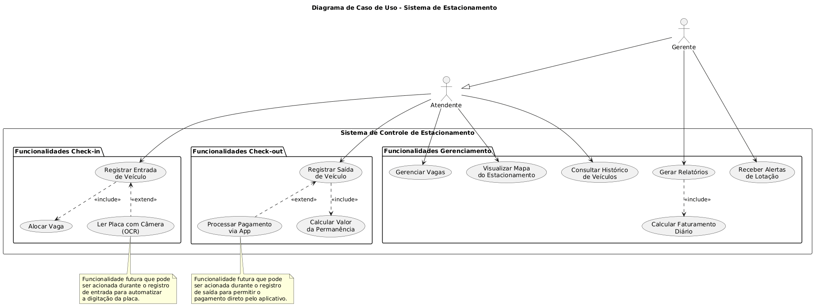

# Diagrama Global de Casos de Uso - Projeto Estacionamento

**Responsável**: Gustavo Rodrigues Ribeiro - GustavooRibas - Arquiteto de Software \
**Data**: 03/09/2025

## Grupo 3
| Aluno | Github |
|-------------|-------------|
|Gustavo Rodrigues Ribeiro | GustavooRibas
|Murillo Gordo de Andrade | murilloandrade
|Davi de Souza Fernandes | sfDav
|Felipe Alves Leão de Araújo | FelipeAlvesLeao

## Introdução

Este documento apresenta o Diagrama Global de Casos de Uso para o Aplicativo de Controle de Estacionamento. O diagrama foi desenvolvido com base nos requisitos levantados durante a entrevista com Carlos, gerente do estacionamento, e reflete as funcionalidades prioritárias para o MVP (Produto Mínimo Viável). O objetivo principal do sistema é automatizar o registro de veículos, o controle de vagas e a geração de relatórios, substituindo o processo manual atual.

## Atores

- **Atendente:** Usuário principal do sistema, responsável pelas operações diárias. Suas funções incluem registrar a entrada e saída de veículos, gerenciar a ocupação das vagas e consultar o histórico de movimentação.
- **Gerente:** Supervisor do estacionamento. Possui todas as permissões do Atendente e, adicionalmente, tem acesso a funcionalidades estratégicas, como a geração de relatórios de faturamento e o recebimento de alertas do sistema.

## Casos de Uso (MVP)

- **Registrar Entrada de Veículo (Check-in):** Permite ao Atendente registrar a placa e o horário de entrada de um veículo. O sistema, de forma automática, aloca uma vaga disponível.
- **Registrar Saída de Veículo (Check-out):** Permite ao Atendente finalizar a permanência de um veículo. O sistema calcula automaticamente o valor a ser pago com base no tempo de permanência.
- **Gerenciar Vagas:** Permite ao Atendente e ao Gerente visualizar o status de todas as vagas (disponíveis ou ocupadas) em tempo real.
- **Visualizar Mapa do Estacionamento:** Exibe um mapa simplificado do pátio para ajudar na localização e direcionamento dos clientes às vagas.
- **Consultar Histórico de Veículos:** Permite ao Atendente e ao Gerente pesquisar registros de veículos que já utilizaram o estacionamento.
- **Gerar Relatórios:** Funcionalidade exclusiva do Gerente para extrair dados consolidados sobre faturamento diário, tempo médio de permanência e horários de pico.
- **Receber Alertas de Lotação:** O sistema notifica o Gerente quando o estacionamento está próximo de atingir sua capacidade máxima.

## Diagrama de Casos de Uso (Imagem)


## Diagrama de Casos de Uso (Código PlantUML)

```
@startuml
' Título do diagrama
title Diagrama de Caso de Uso - Sistema de Estacionamento

' Atores do sistema
actor Atendente
actor Gerente

' Relação de herança: Gerente faz tudo que o Atendente faz, e mais.
Gerente --|> Atendente

' Fronteira do sistema, com pacotes para organização
rectangle "Sistema de Controle de Estacionamento" {

  ' Pacote para as funcionalidades de Check-in
  package "Funcionalidades Check-in" {
    usecase UC1 as "Registrar Entrada\nde Veículo"
    usecase UCInc1 as "Alocar Vaga"
    usecase UCExt1 as "Ler Placa com Câmera\n(OCR)"
  }

  ' Pacote para as funcionalidades de Check-out
  package "Funcionalidades Check-out" {
    usecase UC2 as "Registrar Saída\nde Veículo"
    usecase UCExt2 as "Processar Pagamento\nvia App"
    usecase UCInc2 as "Calcular Valor\nda Permanência"
  }

  ' Pacote para funcionalidades de gerenciamento do estacionamento
  package "Funcionalidades Gerenciamento" {
    usecase UC3 as "Gerenciar Vagas"
    usecase UC4 as "Visualizar Mapa\ndo Estacionamento"
    usecase UC5 as "Gerar Relatórios"
    usecase UC6 as "Consultar Histórico\nde Veículos"
    usecase UC7 as "Receber Alertas\nde Lotação"
    usecase UCInc3 as "Calcular Faturamento\nDiário"
  }
}

' --- Relacionamentos dos Atores com os Casos de Uso ---

' O Atendente interage com as funcionalidades operacionais básicas
Atendente --> UC1
Atendente --> UC2
Atendente --> UC3
Atendente --> UC4
Atendente --> UC6

' O Gerente, além de herdar as ações do Atendente, tem acesso às funções estratégicas
Gerente --> UC5
Gerente --> UC7


' --- Relacionamentos entre Casos de Uso ---

' Relações de Inclusão (<<include>>): A ação é obrigatória
UC1 ..> UCInc1 : <<include>>
UC2 ..> UCInc2 : <<include>>
UC5 ..> UCInc3 : <<include>>

' Relações de Extensão (<<extend>>): A funcionalidade base pode ser estendida
UC1 <.. UCExt1 : <<extend>>
UC2 <.. UCExt2 : <<extend>>


' --- Notas Explicativas ---
note bottom of UCExt1
  Funcionalidade futura que pode
  ser acionada durante o registro
  de entrada para automatizar
  a digitação da placa.
end note

note bottom of UCExt2
  Funcionalidade futura que pode
  ser acionada durante o registro
  de saída para permitir o
  pagamento direto pelo aplicativo.
end note

@enduml
```

## Descrição do Diagrama

O diagrama ilustra as interações entre os atores e o sistema, organizadas em pacotes lógicos:

-   O **Atendente** executa as operações centrais de check-in, check-out e gerenciamento de vagas.
-   O **Gerente** herda todas as funcionalidades do Atendente e possui acesso exclusivo aos módulos de relatórios e alertas, focando na gestão do negócio.
-   A relação **`<<include>>`** indica funcionalidades que são partes obrigatórias de um processo maior (ex: `Calcular Valor` é sempre executado ao `Registrar Saída`).
-   A relação **`<<extend>>`** sinaliza funcionalidades futuras, como `Ler Placa com Câmera` e `Processar Pagamento via App`, que poderão ser adicionadas ao sistema após o MVP.

O diagrama foca estritamente nas prioridades do MVP definidas por Carlos, excluindo funcionalidades como reserva de vagas por clientes e pagamento via aplicativo na versão inicial.

## Observações

-   O diagrama foi elaborado usando a sintaxe **PlantUML**.
-   A utilização de **herança** entre `Gerente` e `Atendente` simplifica o diagrama e representa corretamente a hierarquia de permissões.
-   A organização em **pacotes** ("Check-in", "Check-out", "Gerenciamento") foi adotada para agrupar casos de uso relacionados, melhorando a clareza e a legibilidade do modelo.
-   O escopo do diagrama está diretamente alinhado com as prioridades definidas na entrevista, garantindo que o desenvolvimento inicial se concentre no que gera mais valor para a operação do estacionamento.