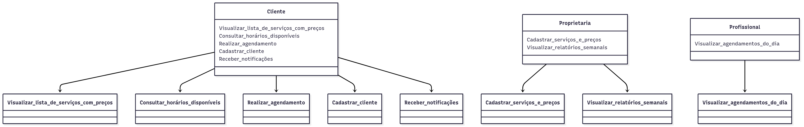
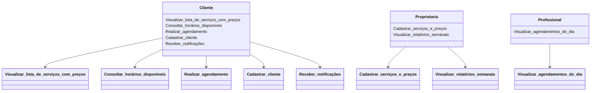

# Diagrama Global de Casos de Uso - Aplicativo Beleza & Estilo

## Grupo 1
| Aluno | Github |
|-------------|-------------|
|Gabriel Freitas dos Reis | GabrielFRails
|Gabriel Rodrigues Silva | Gabriellrs
|Laura Martins Vieira Gonçalves | lauramvg1821
|Léia Santos Costa | Leia27
|Tallya Jesus Sousa Barbosa | tallya01

## Introdução
Este documento apresenta o Diagrama Global de Casos de Uso para o aplicativo "Beleza & Estilo", desenvolvido com base no Documento de Visão (versão 1.0). O diagrama reflete as funcionalidades do MVP (produto mínimo viável) para automatizar o agendamento de serviços, gerenciar cadastros e fornecer relatórios, conforme os requisitos levantados.

## Atores
- **Cliente**: Usuário final (principalmente mulheres de 20 a 50 anos) que utiliza o aplicativo para visualizar serviços, consultar horários, agendar, se cadastrar e receber notificações.
- **Proprietária (Administradora)**: Responsável por gerenciar o salão, cadastrar serviços/preços e visualizar relatórios.
- **Profissional**: Funcionário do salão que consulta os agendamentos atribuídos.

## Casos de Uso
1. **Visualizar lista de serviços com preços**: Permite ao cliente ver os serviços oferecidos e seus preços.
2. **Consultar horários disponíveis**: Permite ao cliente verificar os horários livres para agendamento.
3. **Realizar agendamento**: Permite ao cliente selecionar serviço, profissional e horário para agendar.
4. **Cadastrar cliente**: Permite ao cliente criar um cadastro simples com nome e telefone.
5. **Receber notificações**: Envia confirmações e lembretes de agendamento ao cliente (via app ou WhatsApp).
6. **Cadastrar serviços e preços**: Permite à proprietária gerenciar a lista de serviços, preços e profissionais associados.
7. **Visualizar relatórios semanais**: Permite à proprietária acessar resumos de atendimentos e serviços mais solicitados.
8. **Visualizar agendamentos do dia**: Permite ao profissional consultar os agendamentos atribuídos.

## Diagrama de Casos de Uso (Imagem)

## Diagrama de Casos de Uso (Código Mermaid)

## Descrição do Diagrama
O diagrama ilustra as interações entre os atores e o sistema:
- O **Cliente** utiliza o aplicativo para visualizar serviços, consultar horários, agendar, se cadastrar e receber notificações (confirmação e lembretes).
- A **Proprietária** gerencia o sistema cadastrando serviços/preços e acessando relatórios semanais para planejar promoções.
- O **Profissional** consulta os agendamentos do dia para organizar seu trabalho.
O diagrama foca no MVP, excluindo funcionalidades futuras como pagamento online e login com redes sociais, conforme especificado no Documento de Visão.

## Observações
- O diagrama foi elaborado usando a sintaxe Mermaid para renderização no GitHub. (fonte: https://www.mermaidchart.com/)
- A funcionalidade "Cadastrar serviços e preços" foi incluída com base no requisito RF01, que menciona a necessidade de a proprietária gerenciar serviços e preços.
- O diagrama está alinhado com as prioridades do MVP (seção 4 do Documento de Visão) e os requisitos de alto nível (seção 3).

---

**Responsável**: [Gabriel Freitas/GabrielFRails/Arquiteto]  
**Data**: 03/09/2025